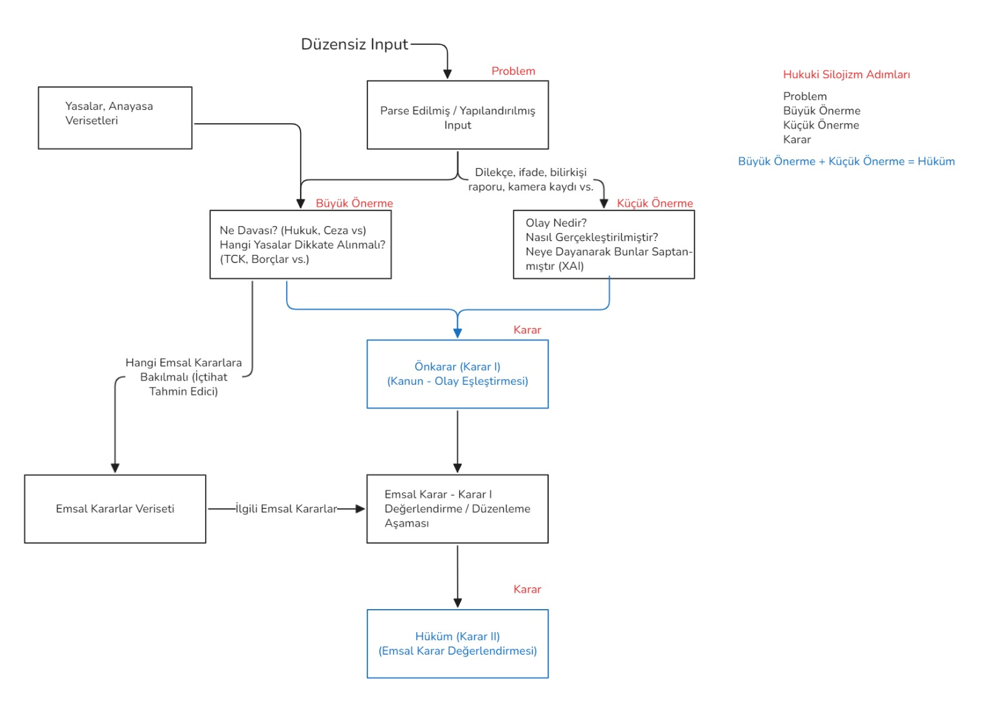

# Lextr: Yapay Zeka Destekli Agentic Anayasal Hakim Destek Sistemi
## Teknik Tasarım ve Mimari Dokümantasyonu v1.0

### 1. Proje Künyesi ve Kapsam
* **Proje Adı:** Lextr
* **Proje Ekibi:** Furkan Yallıç, Remzi Özmen, Said Berk, Tunahan Yılmaz
* **Kurum:** Gazi Üniversitesi
* **Amaç:** Türkiye Cumhuriyeti Anayasası ve Anayasa Mahkemesi kararları üzerine eğitilmiş, hukuki silojizm (mantık yürütme) yapabilen alan özgü bir Yapay Zekâ Vekili (Ajanı) geliştirmektir.
* **Hedef Kitle:** Hakimler, hukukçular, yargı mensupları ve adalete yaklaşma tutkusu olan herkes.

---

### 2. Genel Özet
Lextr, anayasal yargı süreçlerinde tutarlılığı, verimliliği ve yorumlanabilirliği artırmak amacıyla tasarlanmış bir "Mükemmel Sistem" (The Perfect System) adayıdır. Sistem, hukuksal metinleri (dilekçe, ifade, bilirkişi raporu) işleyerek, bunları hukuki silojizm adımları üzerinden analiz eder ve gerekçeli karar taslağı oluşturur.

---

### 3. Hukuki Silojizm Mimarisinin LangChain ile Gerçeklenmesi

Sistemin kalbi, klasik mantığın hukukta uygulanması olan **Hukuki Silojizm** (Major Önerme + Minör Önerme = Sonuç) prensibine dayanır. Bu akış, LangChain kullanılarak zincirleme bir düşünce yapısı (Chain of Thought - CoT) ile aşağıdaki gibi mimariye dökülmüştür:

#### Adım 1: Girdi İşleme ve Yapılandırma (Input Parsing)
* **Girdi:** Düzensiz metin (Dava dilekçesi, bilirkişi raporları, kamera kaydı dökümleri).
* **LangChain Bileşeni:** `PydanticOutputParser` veya `StructuredOutputParser`.
* **İşlem:** Ham metin, LLM tarafından işlenerek "Olay Örgüsü", "İddialar" ve "Talepler" şeklinde yapılandırılmış JSON formatına çevrilir.

#### Adım 2: Büyük Önerme (Major Premise) - Normatif Çerçeve
* **Soru:** "Bu olay hangi hukuk kurallarına temas ediyor?" (Hukuk davası mı, Ceza davası mı? Hangi kanun maddeleri?)
* **Teknoloji:** **RAG (Retrieval-Augmented Generation)**.
* **İşleyiş:** Sistem, yapılandırılmış girdideki anahtar kelimeleri kullanarak Vektör Veritabanında (ChromaDB/Pinecone) Anayasa ve Kanun maddelerini arar.
* **Çıktı:** İlgili kanun maddelerinin tam metni.

#### Adım 3: Küçük Önerme (Minor Premise) - Maddi Vakıa
* **Soru:** "Olay nedir? Nasıl gerçekleşmiştir? Kanıtlar nelerdir?"
* **Teknoloji:** **XAI (Açıklanabilir Yapay Zeka) & Summarization Chains**.
* **İşleyiş:** LangChain `MapReduceDocumentsChain` kullanılarak dosyadaki deliller özetlenir. Sistem, "Şu kanıta dayanarak bu olayın gerçekleştiği saptanmıştır" şeklinde referanslı bir olgusal özet çıkarır.

#### Adım 4: Ön Karar (Decision I) - Subsumption
* **Mantık:** Büyük Önerme (Kanun) + Küçük Önerme (Olay) → Ön Karar.
* **LangChain Bileşeni:** `SequentialChain`.
* **İşleyiş:** LLM, retrieved edilen kanun maddesini olaya uygular (subsumption). Henüz emsal kararlara bakılmaksızın, saf kanuni bir çıkarım yapar.

#### Adım 5: Emsal Karar Değerlendirme (Precedent Evaluation)
* **Soru:** "Daha önce benzer olaylarda Yüksek Mahkeme ne dedi?"
* **Teknoloji:** **RAG (UYAP Emsal Karar Veritabanı) + Similarity Search**.
* **İşleyiş:** Ön karar taslağı ve olay örgüsü vektörize edilerek geçmiş içtihatlarla kıyaslanır. Sistem, kararı destekleyen veya çelişen emsalleri getirir.

#### Adım 6: Nihai Hüküm (Final Judgment)
* **Çıktı:** Gerekçeli Karar Taslağı.
* **İşleyiş:** Ön karar ve emsal kararların sentezlenmesiyle, hakimin üslubuna uygun nihai metin oluşturulur.

Resim 1: Şema
---

### 4. Stratejik Ayrım: Nerede RAG, Nerede Fine-Tune?

Projenin başarısı için en kritik teknik karar, bilginin nerede saklanacağıdır. Hibrit bir yaklaşım benimsenmelidir:

#### A. RAG (Retrieval-Augmented Generation) Kullanım Alanları
**Bilgi Kaynağı Olarak:** Dinamik, kesin ve referans gerektiren veriler.

1.  **Mevzuat (Kanunlar/Anayasa):** Kanunlar değişebilir ve bir kelime hatası bile hükmü bozar. LLM'in kanunu ezberlemesi (hallüsinasyon riski) yerine, RAG ile veritabanından **güncel ve tam metni** çekmesi şarttır.
2.  **Emsal Kararlar (İçtihatlar):** Milyonlarca mahkeme kararı vardır. Bunların hepsini modele "öğretmek" (fine-tune) verimsizdir. Bunun yerine, mevcut davaya en çok benzeyen 5 kararı getirmek için RAG kullanılmalıdır.
    * *Kullanılacak Araç:* Vector Store (Örn: `text-embedding-3-large` ile embed edilmiş UYAP verileri).

#### B. Fine-Tuning (SFT - Supervised Fine-Tuning) Kullanım Alanları
**Davranış ve Yetenek Olarak:** Muhakeme yeteneği, üslup ve format.

1.  **Hukuki Muhakeme (Reasoning):** Genel amaçlı bir model (GPT-4 veya Llama 3), bir "asistan" gibi konuşur. Ancak bir hakimin olaylara yaklaşımı, neden-sonuç ilişkisi kurma biçimi (silojizm) farklıdır. Modeli, Anayasa Mahkemesi'nin gerekçeli kararlarıyla eğiterek ona **"Hukukçu gibi düşünme"** (Legal Reasoning) yeteneği kazandırılmalıdır.
2.  **Üslup ve Terminoloji (Legalese):** "Karar verildi" yerine "Hüküm kuruldu", "bence" yerine "kanaatine varılmıştır" gibi spesifik hukuk dilini (jargon) doğru kullanması için Fine-Tune gereklidir.
3.  **Çıktı Formatı:** Mahkeme kararlarının şablon yapısını (Esas No, Karar No, Hüküm Fıkrası vb.) öğrenmesi için eğitilmelidir.

---

### 5. Sistem Mimarisi ve Teknoloji Yığını

| Katman | Teknoloji / Araç | Sorumluluk |
| :--- | :--- | :--- |
| **Arayüz (Frontend)** | React / Streamlit | Sürükle-bırak dosya yükleme, Chatbot arayüzü. |
| **Orchestration** | **LangChain (Python)** | Silojizm akışının yönetimi, Prompt zincirleri. |
| **LLM (Model)** | Gemini 3.0 Pro |
| **Knowledge Base** | ChromaDB / Pinecone | Mevzuat ve Emsal Kararların vektör veritabanı. |
| **Data Protocol** | MCP (Model Context Protocol) | Standartlaştırılmış veri iletişimi. |
| **Deployment** | AWS / Azure | API ve sunucu barındırma. |

### 6. Gelecek Planları ve Sürdürülebilirlik
Proje tamamlandığında, sadece bir arama motoru değil, hakimin karar verme sürecine aktif katılan bir **"Karar Destek Asistanı"** (Judicial Decision Support System) ortaya çıkacaktır. XAI (Açıklanabilir Yapay Zeka) entegrasyonu sayesinde, sistemin hangi delili neden dikkate aldığı şeffaf bir şekilde kullanıcıya sunulacaktır.